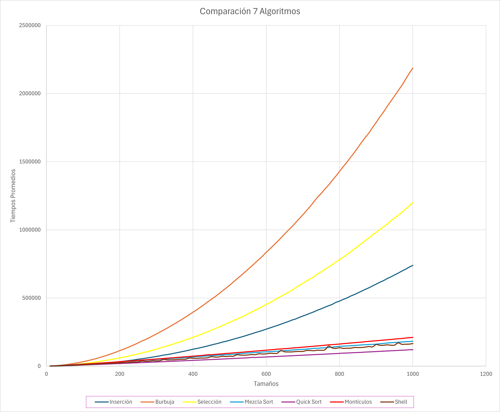

# Análisis de Algoritmos de Ordenación
Análisis comparativo de tiempos de ejecución de los principales métodos de ordenación de datos comparados con la cantidad de datos a ordenar.

Los métodos de ordenación utilizados son:

  - Inserción
  - Burbuja Optimizado
  - Selección
  - Mezcla
  - Quick Sort
  - Montículos
  - Shell

El programa consiste en ordenar conjuntos de datos con los métodos mencionados previamente, el cual facilita la generación de elementos gráficos que auxilien a la comprensión acerca de los tiempos promedio que cada algortimo requiere, con el apoyo de archivos .csv donde se almacenan, por lo que esto da resultados variando la cantidad de datos a ordenar y a su vez el método escogido , lo que produce una diversidad en los promedios de los tiempos y a su vez los datos de los conjuntos ordenados son generados de manera aleatoria, garatizando resultados más imparciales.

El código inicializa con un procedimiento que se repitirá mil veces, donde en cada ocasión se generan 100 conjuntos de diferentes tamaños.

Los tamaños son:

   *10, 20, 30, 40, ..., 1000*                                       

A cada conjunto de dimensión 10 al 1000 se le aplica un método de ordenación y se registran los tiempos, lo cual se hace con los 7 métodos de ordenación, es decir, que después de completar el primer vector de tiempos para todos los métodos, procedemos a generar 100 nuevos conjuntos de números aleatorios en esta segunda repetición de las mil veces, para volver a aplicarle los 7 métodos y de manera sucesiva se realiza este procedimiento hasta completar 100 veces. 
Al final se calculan los promedios por método y por tamaño de los conjuntos de datos a ordenar, a su vez los datos son enviados a un archivo csv para cada uno de los métodos.

---
## Requisitos del sistema para ejecutar el código
 - C++
 - g++

## Compilación y ejecución del código


Introducir en la terminal:

***Clonación:***
  ```bash
   git clone https://github.com/FerHdez08/Algoritmos-de-Ordenamiento.git
```
***Cambio de directorio:***
```bash
   cd Algoritmos-de-Ordenamiento
```
***Compilación:***
```bash
   g++ -o Algoritmos Algoritmos.cpp
```
***Ejecución:***
```bash
   Algoritmos
```
*o en su defecto, si no es reconocido, ejecute:*
```bash
   .\Algoritmos
```
---
## Descripción de los algoritmos implementados
 - **Inserción:**
   Este método se lleva a cabo de la siguiente forma, en un principio suponemos que el primer elemento ya está ordenado, debido a que no hay con que compararlo.<br>
   Luego tomamos el siguiente elemento y lo comparamos con los valores anteriores, si es menor que el de antes, lo desplazamos hacia la izquierda hasta encontrar el lugar adecuado para su inserción.<br>
   Repite el proceso hasta recorrer todos los datos y hasta que cada elemento esté en su posición correspondiente.
   
 - **Burbuja:**
   En cuanto al algoritmo, se pone a comparar elementos adyacentes, es decir parejas consecutivas, el elemento y el que esta a lado suyo, en lo que sería un arreglo.  
   Los intercambia si están en el orden incorrecto.   
	 Repite este proceso hasta que el arreglo esté completamente ordenado.<br>
   Esta versión optimizada al contener una bandera, desempeña el papel donde detecta si se hacen o no intercambios, en caso de que no haya habido intercambios se sabrá que los elementos ya se encuentran 
   ordenados y daría por terminado el proceso.

 - **Selección:**
   El algoritmo busca el elemento más pequeño en el arreglo y lo coloca en la primera posición.<br>
   Luego, repite el proceso para el resto del arreglo, buscando el siguiente elemento más pequeño y colocándolo en la posición correcta.

 - **Mezcla:**
   El arreglo se divide recursivamente en dos mitades hasta que cada subarreglo tiene un solo elemento. <br>
   Esto se hace dividiendo el arreglo en la mitad central hasta llegar a los casos base, es decir, arreglos de tamaño 1.<br>
   Consiste en que una vez que el arreglo está dividido en subarreglos de un solo elemento, se comienza a mezclar o combinar esos subarreglos de manera ordenada.<br>
   Se comparan los elementos de dos subarreglos y se colocan en el arreglo original en orden ascendente, hasta que todos los elementos están correctamente ordenados.<br>

 - **Quick Sort:**
   En cuanto a este algoritmo, consiste en seleccionar un pivote, en este caso, es el último elemento del subarreglo, para luego organizar el arreglo de manera que los elementos menores que el pivote estén a la izquierda
	 y los mayores a la derecha. <br>
   Después, divide el arreglo en dos partes, una con los elementos menores que el pivote, otra con los mayores y de manera recursiva ordena ambas partes.
   
 - **Montículos**
   El algoritmo utiliza una estructura de datos llamada montículo,que es un tipo especial de árbol binario completo. <br>
   El algoritmo funciona de la siguiente manera:<br>
   	
   BUILD_MAX:<br>
   Se comienza con la construcción de un montículo máximo a partir del arreglo de entrada. <br>
   Un montículo máximo es una estructura en la que, para cada nodo, el valor de ese nodo es mayor o igual que el valor de sus hijos.<br>
   La función BUILD_MAX recorre el arreglo desde la mitad hacia el inicio (ya que los nodos hoja no necesitan ser ajustados) y aplica la función MAX_HEAPIFY para garantizar que todos los subárboles cumplan 
   la propiedad de montículo máximo.<br>

   Montículos:<br>
   Una vez que el arreglo es un montículo máximo, el algoritmo comienza a ordenar el arreglo.<br>
   En cada iteración, intercambia el primer elemento del montículo (el más grande) con el último, reduce el tamaño del montículo y aplica MAX_HEAPIFY para restaurar la propiedad del montículo en el resto del 
   arreglo. <br>
   Repite este proceso hasta que el arreglo está completamente ordenado. <br>

   MAX_HEAPIFY:<br>
   Esta asegura que el subárbol con raíz en un índice dado cumpla con la propiedad de montículo máximo.<br>
   Compara el nodo actual con sus hijos y si uno de los hijos es mayor, intercambia el valor del nodo con el hijo mayor. <br>
	 Luego, aplica MAX_HEAPIFY recursivamente en el subárbol afectado.

 - **Shell:**
   La idea implementada en este código es que es una mejora del algoritmo de inserción. La principal diferencia es que este algoritmo permite intercambiar elementos no necesariamente consecutivos, lo que mejora 
   la eficiencia de la ordenación.<br>
   Utiliza brechas o gaps para ordenar elementos que están más separados al principio y luego se van reduciendo las brechass hasta llegar a una ordenación por inserción clásica.<br>


| Algoritmo   |   Orden Promedio |  
|:------------|:--------:|
| Inserción   | O( n² )  | 
| Burbuja     | O( n² )  | 
| Selección   |  O( n² ) |
| Mezcla Sort |O(n log n)|
| Quick Sort  |O(n log n)|
| Montículos  |O(n log n)|
| Shell       |O(n log n)|

---
## Gráfica comparativa de los tiempos promedios de ejecución de los algoritmos implementados

La imagen a continuación es la comparación de los tiempos promedios a través de los tamaños de los conjuntos, reflejados en cada uno de los métodos de ordenación:



En la gráfica, podemos observar que los primeros tres métodos de ordenación (inserción, burbuja y selección) presentan una curva claramente mayor a las otras, lo que resalta el hecho de que son de orden cuadrático en los tiempos de ejecución. En contraste, los otros cuatro algoritmos muestran un crecimiento significativamente más lento, lo que incluso podría interpretarse como un comportamiento casi lineal en comparación. Para una mejor visualización de estos métodos más eficientes, generaremos una gráfica adicional enfocada exclusivamente en ellos, permitiendo una comparación más detallada de sus comportamientos.


En esta gráfica podemos observar que los algoritmos no presentan un crecimiento lineal en sus tiempos de ejecución, lo que indica que su orden no es de n, sin embargo, a diferencia de los primeros tres métodos (*inserción, burbuja y selección*), su rendimiento es considerablemente mejor, lo cual lleva a deducir que los ordenamientos de los tiempos promedios de estos 4 algoritmos no son de orden cuadrático, por el contrario sus tiempos promedios reflejan el hecho de que poseen un orden logarítmico.

***En conclusión las dos gráficas muestran de forma evidente los comportamientos que tienen los algoritmos en cuanto a su eficiencia de ordenación de datos, por lo que ahora podríamos identificar y ordenar de manera sencilla, el lugar que merece cada algoritmo en cuanto a mejor y peor método de ordenamiento dependiendo de su optimización, lo que nos lleva a declarar como ganador indiscutible al quick sort como su nombre lo sugiere, por otra parte, como el peor de los perdedores al algoritmo de burbuja, siendo que este llega a tardar casi el doble de nuestro ganador.***
