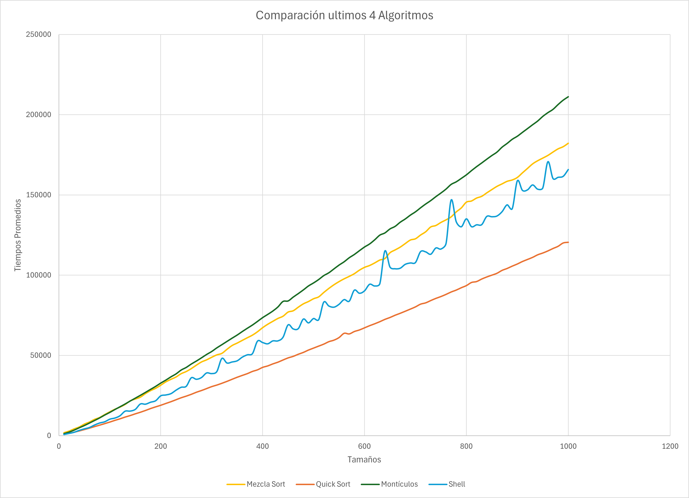

# Análisis de Algoritmos de Ordenación
Análisis comparativo de tiempos de ejecución de los principales métodos de ordenación de datos comparados con la cantidad de datos a ordenar.

Los métodos de ordenación utilizados son:

  - Inserción
  - Burbuja Optimizado
  - Selección
  - Mezcla Sort
  - Quick Sort
  - Montículos
  - Shell

El programa consiste en ordenar cojuntos de datos con los métodos mencionados previamente, el cual facilita la generación de elementos gráficos que auxilien a la comprensión acerca de los tiempos promedio que cada algortimo requiere, con el apoyo de archivos .csv donde se almacenan, por lo que esto da resultados variando la cantidad de datos a ordenar y a su vez el método escogido , lo que produce una diversidad en los promedios de los tiempos y a su vez los datos de los conjuntos ordenados son generados de manera aleatoria, garatizando resultados más imparciales.

El código inicializa con un procedimiento que se repitirá mil veces, donde en cada ocasión se generan 100 conjuntos de diferentes tamaños.

Los tamaños son:

   *10, 20, 30, 40, ..., 1000*                                       

A cada conjunto de dimensión 10 al 1000 se le aplica un método de ordenación y se registran los tiempos, lo cual se hace con los 7 métodos de ordenación, es decir, que después de completar el primer vector de tiempos para todos los métodos, procedemos a generar 100 nuevos conjuntos de números aleatorios en esta segunda repetición de las mil veces, para volver a aplicarle los 7 métodos y de manera sucesiva se realiza este procedimiento hasta completar 100 veces. 
Al final se calculan los promedios por método y por tamaño de los conjuntos de datos a ordenar, a su vez los datos son enviados a un archivo csv para cada uno de los métodos.

## Requisitos del sistema para ejecutar el código
 - C++
 - g++

## Compilación y ejecución del código
***Clonación:***
  ```bash
   git clone https://github.com/FerHdez08/Algoritmos-de-Ordenamiento.git
   cd Algoritmos-de-Ordenamiento
```
***Compilación:***
```bash
   g++ -o Algoritmos Algoritmos.cpp
```
***Ejecución***
```bash
   Algoritmos.exe
```
## Descripción de los algoritmos implementados

## Gráfica comparativa de los tiempos promedios de ejecución de los algoritmos implementados

La imagen a continuación es la comparación de los tiempos promedios a través de los tamaños de los conjuntos, reflejados en cada uno de los métodos de ordenación:


En la gráfica, podemos observar que los primeros tres métodos de ordenación (inserción, burbuja y selección) presentan una curva claramente mayor a las otras, lo que resalta el hecho de que son orden cuadrático en los tiempos de ejecución. En contraste, los otros cuatro algoritmos muestran un crecimiento significativamente más lento, lo que incluso podría interpretarse como un comportamiento casi lineal en comparación. Para una mejor visualización de estos métodos más eficientes, generaremos una gráfica adicional enfocada exclusivamente en ellos, permitiendo una comparación más detallada de sus comportamientos.



En esta gráfica podemos observar que los algoritmos no presentan un crecimiento lineal en sus tiempos de ejecución, lo que indica que su orden no es de n, sin embargo, a diferencia de los primeros tres métodos (*inserción, burbuja y selección*), su rendimiento es considerablemente mejor, lo cual lleva a deducir que los ordenamientos de los tiempos promedios de estos 4 algoritmos no son de orden cuadrático, por el contrario sus tiempos promedios reflejan el hecho de que poseen un orden logarítmico.

***En conclusión las dos gráficas muestran de forma evidente los comportamientos que tienen los algoritmos en cuanto a su eficiencia de ordenación de datos, por lo que ahora podríamos identificar y ordenar de manera sencilla, el lugar que merece cada algoritmo en cuanto a mejor y peor método de ordenamiento dependiendo de su optimización, lo que nos lleva a declarar como ganador indiscutible al quick sort como su nombre lo sugiere, por otra parte, como el peor de los perdedores al algoritmo de burbuja, siendo que este llega a tardar casi el doble de nuestro ganador.***
